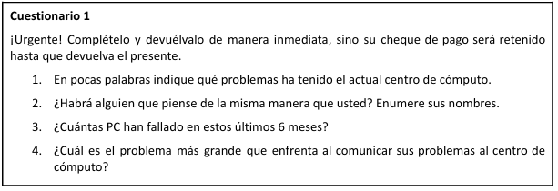

# Practica 1 - Ingenieria de Software 1

## Indice
- [Entrevistas](#entrevistas)
    - [Parte II Situaciones](#parte-ii-situaciones)
    - [Parte II Problemas](#parte-ii-problemas)
- [Cuestionarios](#cuestionarios)
    - [Parte I Definiciones](#parte-i-definiciones)
    - [Parte II Situaciones](#parte-ii-situaciones-1)

## Entrevistas
### Parte II Situaciones

### Situacion 1

***Tiene una entrevista con el gerente de ventas de una empresa el cual desea informatizar dicho sector pero no tuvo tiempo de preparar las preguntas por lo que le pidió a un nuevo empleado que le prepare algunas. Cuando las lee, se da cuenta que son inadecuadas***

***Leer las preguntas y volver a redactarlas de una manera más apropiada. Especificar por qué le parece inadecuada cada una de ellas.***

 **a. Sus subordinados me dijeron que la empresa no anda bien. ¿Es cierto?**

 - Cuenta con un enfoque negativo basandose en supociciones, esto podria hacer sentir incomodo al entrevistado ademas de generar duda ante el profesionalismo del entrevistador.
- La pregunta deberia ser encaminada a la neutralidad:  
¿Que desafios esta abordando la empresa actualmente?
  Ademas se podria agregar una pregunta buscando la mejoria de estos "desafios".

**b. Soy nuevo en esto. ¿Qué he dejado afuera?**  

-  Al decir esto da una muestra de falta de profesionalismo, la pregunta tendria que ser mas sutil:  
¿Usted quiere hablar de algo que no hemos tocado?

**c. ¿Estará usted de acuerdo con los demás gerentes de ventas, respecto a que computarizar las ventas mensuales y luego realizar un análisis de la tendencia tendría usted grandes mejoras?**

- Esta pregunta tiene un enfoque, al nombrer a los gerentes se da a entender que pensar como ellos es lo "correcto". Seria mejor preguntarle unicamente por su opinion sobre el nuevo sistema y como piensa él que podria impactar tomar esas decisiones.

**d. ¿No habrá una mejor manera de hacer proyecciones de sus ventas, que ese procedimiento anticuado que usted utiliza?**

- Haciendo esta pregunta estamos atacando el procedimineto que utiliza el entrevistado, generando incomodidad y falta de neutralidad
- Lo mejor seria preguntar sobre ese sistema que el utiliza y si ha pensado cambiar ese aspecto:  
¿Cómo evalúa la efectividad de su proceso actual para proyectar ventas? ¿Ha considerado o explorado nuevas herramientas o métodos para mejorar estas proyecciones?

### Situacion 2

***Apenas ha entrado a la oficina de su entrevistado se da cuenta que él no ha dejado de revisar papeles, mirar el reloj y hacer llamadas telefónicas. Usted supone que se siente nervioso porque está atrasado con otro trabajo que tiene que terminar.***

**a. Explicar brevemente cómo resolvería tal situación.**
- En un caso que el entrevistado se encuentre en ese nivel de estres lo mejor seria posponer la entrevista a un horario que el susodicho se encuentre mas liberado de trabajo. Este estres haria que el entrevistado no consteste correstamente las preguntas y de una respuesta rapida o acortada.

**b. Qué opciones propone para el caso en que la entrevista no pueda reprogramarse.**
- En caso de no poder reprogramarse optaria por acortar mi entrevista, buscando hacer las preguntas mas claves de mi lista.

### Situacion 3

***El siguiente es el primer informe de una entrevista realizada por uno de los miembros de su equipo de análisis de sistemas:***

***“En mi opinión, el resultado de la entrevista fue muy bueno. El entrevistado me permitió hablar con él durante una hora y media. Me relató toda la historia del negocio, que fue muy interesante. También mencionó que las cosas no han cambiado desde que él ha estado en la empresa, hace aproximadamente 16 años. En breve nos reuniremos nuevamente para terminar la entrevista, pues, no tuvimos tiempo para analizar las preguntas que preparé “.***

**a. Leer atentamente el informe de la entrevista y explicar qué sensación le deja dicho informe.**

- El informe deja una sensacion de falta de informacion, solo han platicado sin hacer las preguntar de la entrevista.

**b. Indicar si existe información que es irrelevante en el informe.**

- La historia del negocio no considero que se muy relevante, sin embargo lo han estado platicando por una hora y media.

**c. Mencionar tres sugerencias que le haría a su compañero de equipo para que realizara una mejor entrevista la próxima vez.**

- Primero que nada, tomar las riendas de la entrevista, no deberia dejar que se desperdicie el tiempo en una platica irrelevante. Centrarse en las preguntas que ha preparado para la entrevista. Por ultimo practicar antes de encontrarse con el entrevistado.

### Parte II Problemas

### Problema 1

**Preparar una entrevista para obtener los requerimientos del siguiente problema:**

***Se desea desarrollar un sistema que permita compartir un vehículo para un viaje. La idea es que cuando una persona tiene que realizar un viaje lo publique en la aplicación. Luego el resto de los usuarios se postulan para acompañarla y el chofer podrá seleccionar quienes viajan. El objetivo es abaratar costos y evitar congestiones en el tránsito***

- Resolver

### Problema 2

**Preparar una entrevista para obtener los requerimientos del siguiente problema:**

***CookBooks es un negocio pequeño manejado por una pareja jubilada. Hasta este momento, Cookbooks ha vendido sus libros sólo a través de pedidos por correo. Los dueños ahora quieren desarrollar un sistema en línea para vender libros de cocina difíciles de conseguir y agotados a través de internet.  
Los visitantes podrán hojear diferentes libros de cocina, pero tendrán que crear una cuenta del cliente antes de poder hacer una compra. Los pagos se aceptarán sólo en línea con una tarjeta de crédito reconocida.***

- Resolver

## Cuestionarios

### Parte I Definiciones

**1) Describir qué tipo de información se busca mediante la aplicación de cuestionarios.**

- Los cuestionarios son una herramienta clave para recopilar información estructurada y estandarizada en diversos contextos.

**2) Describir bajo qué circunstancia considera apropiado utilizar cuestionarios**

- Cuando se necesita obtener informacion de una gran cantidad de personaes el cuestionario resulta lo mas util. Este formato ademas da anonimato a los participantes por lo tanto las respuestras podrian llegar a ser mas sinceras.

**3) Describir los dos tipos de cuestionarios.**
- Los dos tipos de cuestionarios que hay son el estructurado y no estructurado:
    - Estructurado: Las preguntas tiene respuestas de si/no o multiple choice. Su analisis es rapido.
    - No estructurado: Propone preguntas de respuesta libre y detallada. Al utilizar este tipo de preguntas el analisis de los cuestionarios es mas tardio.

### Parte II Situaciones
### Situacion 1

***Alguien nuevo en el centro de cómputo de un gimnasio que tiene varias sucursales, viene con muchas ganas de mejorar las cosas que ve dentro del mismo. Dicho centro está desarrollando un sistema en red que usarán todas las sucursales.***

**Dado el siguiente cuestionario verifique si es necesario reescribir las preguntas, justificar.**
